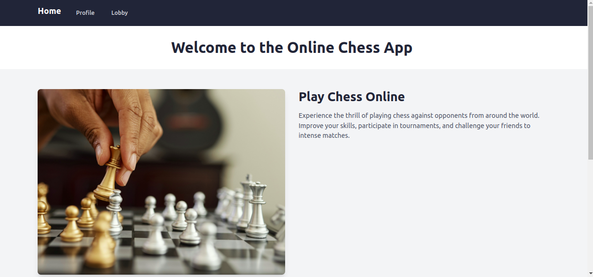
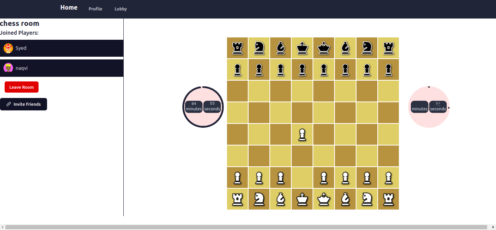

# Online Chess App

The Online Chess App is a web application built with React, Tailwind CSS, and Socket.IO. It allows users to play chess online with their friends and family. Users can invite others to play, and the app provides real-time updates using Socket.IO for a seamless multiplayer experience.

## Features

-   Play chess online with friends and family
-   Real-time updates using Socket.IO
-   User authentication and account management
-   Invite friends to play chess
-   Responsive design for optimal viewing on different devices

## Technologies Used

The Online Chess App utilizes the following technologies:

-   React: A JavaScript library for building user interfaces
-   Tailwind CSS: A utility-first CSS framework
-   Socket.IO: A library for real-time web applications
-   Node.js: A JavaScript runtime environment
-   Express: A minimal and flexible Node.js web application framework
-   MongoDB: A NoSQL database for storing user information and game data

## Getting Started

To run the Online Chess App locally, follow these steps:

1.  Clone the repository: `git clone https://github.com/your-username/online-chess-app.git`
2. Nivigate to server folder.
3.  Install the dependencies: `npm install`
4.  Set up the MongoDB connection string in the `.env` file.
5.  Start the server: `npm start ` or ` npm run dev ` 
6.  Navigate to `http://localhost:8080` in your web browser.

## Usage

1.  Sign up or log in to your account.
2.  Invite a friend or family member to play a game by sharing the unique game link.
3.  Wait for the opponent to join the game.
4.  Make your moves by clicking on the chessboard squares.
5.  Receive real-time updates on the game status and opponent's moves.
6.  Enjoy playing chess with your friend or family member!

## Screenshots

 _The home page of the Online Chess App._

 _The game page where users can play chess with their opponents._

## Contributing

Contributions to the Online Chess App are welcome! If you find any issues or want to add new features, please submit a pull request on the GitHub repository.

## License

The Online Chess App is open-source and released under the [MIT License](https://opensource.org/licenses/MIT). Feel free to modify and use the code as per the license terms.